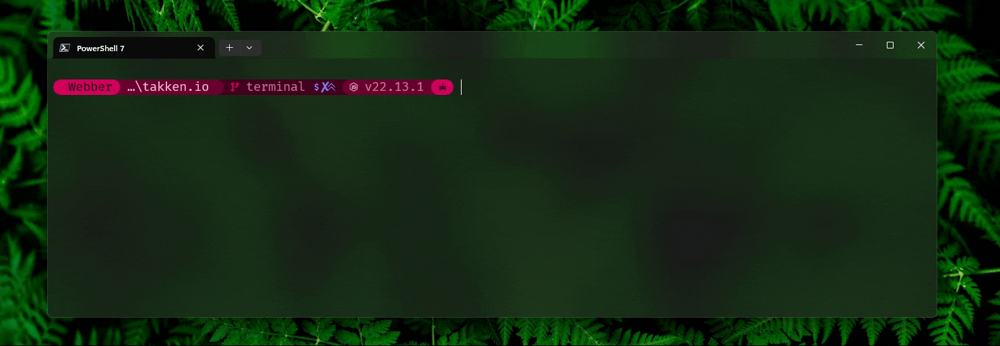
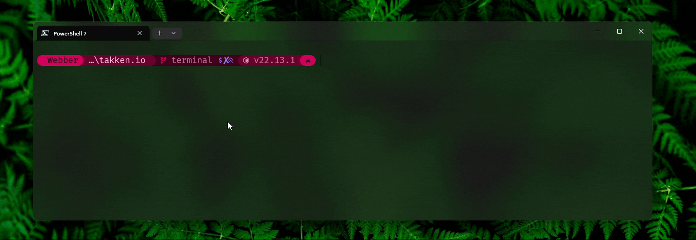
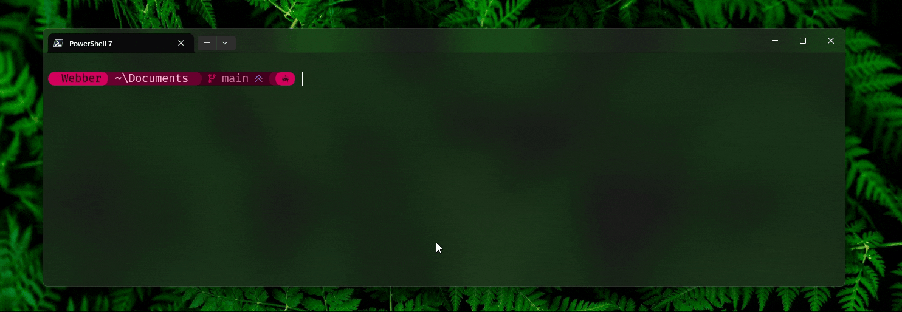
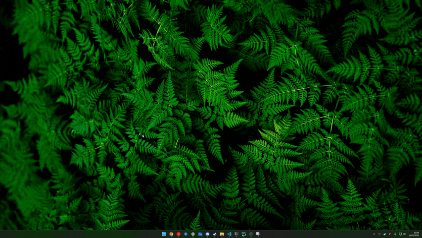
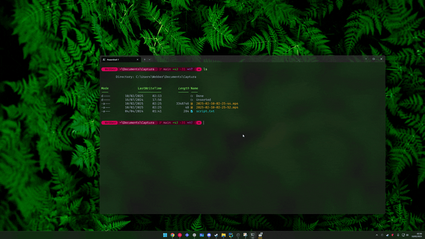

import ImageWrapper from '../../src/components/ImageWrapper'
import Image from '@theme/IdealImage'

# A modern terminal for Windows

Always wanted your terminal to look and function like that of a professional developer? This post is
my attempt at providing a concise guide to setting up a modern terminal, while explaining essential
terminology and decisions made along the way.

To make for a truly slick experience, I have considered different terminals, shells, prompts and
hotkeys, as well as command-line tools and plugins, including typeahead and fuzzy search.

<!-- truncate -->

## A quick tip 💡

Customizing your terminal can be time-consuming, so I use a simple trick to avoid repeating the
process.

My home directory is a git repository. I track only specific config and settings files while
ignoring everything else.

This keeps my setup consistent and makes syncing configurations across machines effortless.

## TL;DR

<details>
  <summary>Just looking for the result?</summary>

    Here's the result you'll get if you follow along.

    <Image
      img={require('./assets/resulting-terminal.png')}
      alt="Screenshot of a terminal window with 4-split panes, showing off colours, prompt and functionality"
    />

    Technologies used:

    - [Windows Terminal](https://github.com/microsoft/terminal)
    - [PowerShell 7](https://github.com/PowerShell/PowerShell)
    - [Nerd Font](https://github.com/ryanoasis/nerd-fonts)
    - [Dracula theme](https://draculatheme.com/windows-terminal)
    - [Starship](https://github.com/starship/starship)
    - [Terminal-Icons](https://github.com/devblackops/Terminal-Icons)
    - [PSReadLine](https://github.com/PowerShell/PSReadLine)
    - [PSFzf](https://github.com/kelleyma49/PSFzf)
    - [Git for Windows](https://gitforwindows.org/), with "Optional Unix tools" option enabled.

    Configuration files:

    - [Starship config](https://gist.github.com/webbertakken/b5413d9a8bcb3644974d719393179b74)
    - [Windows Terminal settings](https://gist.github.com/webbertakken/8af7e20cdfd548294a8ad188612ce27d)
    - [PowerShell profile](https://gist.github.com/webbertakken/78ad5a15d7e8e2e140a9ee8ac62b8419)

</details>

## The Terminal

For the purpose of this post, I'll differentiate between `terminal`, `shell` and `prompt`. Let's
start with the terminal.

### Definition

Historically, a terminal was a physical device consisting of a keyboard and a display (first image),
used for interacting with a computer. Nowadays, we basically wrap a virtual version of such a
terminal in our operating system using a window (second image). Technically it would be called a
`terminal emulator` but its usually called `terminal` for simplicity.

<ImageWrapper>
  <Image
    img={require('./assets/historical-terminal.png')}
    alt="Picture showing a historical terminal; the keyboard and a display of a DEC VT100"
    source={
      <>
        Gorthmog, <a href="https://creativecommons.org/licenses/by-sa/4.0">CC BY-SA 4.0</a>, via
        Wikimedia Commons
      </>
    }
  />
  <Image
    img={require('./assets/modern-terminal.png')}
    alt="Picture showing a modern terminal; a window with tabbed shells"
  />
</ImageWrapper>

### Choice

There are different terminals out there, each with their pros and cons and different way of
configuration. Personally I've used ConEmu, Cmder, windows-terminal-quake and Windows Terminal.

Out of those, I've found [Windows Terminal](https://apps.microsoft.com/detail/9n0dx20hk701?hl=en-GB)
to be the most modern and easy to use. It's also
[actively developed](https://github.com/microsoft/terminal) by Microsoft. It supports tabs, panes,
key bindings, different fonts and character sets, custom themes, quake-style console and much more.

### Installation

<details>
  <summary>Install Windows Terminal</summary>

To install Windows Terminal you have the choice to install it from the Microsoft
[Apps Store](https://apps.microsoft.com/detail/9n0dx20hk701?rtc=1&hl=en-gb), by installing the
`.msi` from the `assets` section of the
[latest release](https://github.com/microsoft/terminal/releases) directly, or using a Windows
package manager below.

#### Chocolatey

```bash
choco install microsoft-windows-terminal
```

#### Winget

```bash
winget install -e --id Microsoft.WindowsTerminal
```

#### Scoop

```bash
scoop bucket add extras
scoop install -g windows-terminal
```

:::note

Once installed, Windows Update will keep Windows Terminal up-to-date for you.

:::

</details>

Once you've installed Windows Terminal, run it. It should look similar to the image below.

<Image
  img={require('./assets/windows-terminal-installed.png')}
  alt="Screenshot of Windows Terminal after a fresh installation"
/>

By default, it opens an old version of PowerShell, that can be recognised by its blue icon.

The first message printed on the terminal is a suggestion of replacing that with something more
modern. Let's do that next.

## The Shell

### Definition

A shell is a digital interface that allows users to interact with the operating system. It can be
graphical, like the Windows Explorer, or command-line based, like Command Prompt (aka `cmd`) and
PowerShell. A shell lets you navigate the system, modify its files and launch scripts and
applications.

<ImageWrapper>
  <Image
    img={require('./assets/windows-explorer-shell.png')}
    alt="Windows Explorer Shell"
    source="Windows Explorer Shell"
  />
  <Image
    img={require('./assets/command-prompt-and-powershell.png')}
    alt="Command Prompt and PowerShell"
    source="Command Prompt and PowerShell"
  />
</ImageWrapper>

### Introduction

If you're a Windows user, chances are you've used Command Prompt, Git Bash, WSL or PowerShell
before. If yes, then you've most likely also found that not all commands work your preferred shell.

:::note Example

For Linux commands you might opt for Git Bash or WSL with Ubuntu running Bash, whereas for Windows
specific commands you've probably used PowerShell or Command Prompt.

:::

Working out how to cater for most use cases in a single shell can also take much time. Especially if
you like to integrate the various available productivity tools into it.

### Rationale

To me, switching between multiple shells comes with two major downsides. Firstly, you lose the
context that you are working in, which means that you can not easily chain commands, reuse output or
pass variables between the shells. Secondly, each shell has unique configurations and quirks,
requiring setup and making for a learning curve. That means double the effort, the occasional
confusion and a huge inhibitor for becoming a command line power user.

Therefore, I'd argue that it is valuable to choose a single shell environment and master it
thoroughly. It is, then, also important to choose a shell that modern and powerful enough for most
use cases.

Luckily, today there are excellent tools available that can make a Windows shell almost as powerful
as their Linux counterparts.

### Choice

I've found PowerShell 7 to be the most modern and powerful command-line shell for Windows. It is
open-source, works across Windows, Linux and MacOS and features a built-in scripting language. It
also allows you to easily install plugins. PowerShell is well maintained and has a decent ecosystem.

### Installation

<details>
  <summary>Install PowerShell 7</summary>

To install PowerShell 7 you have the choice to install it from the Microsoft
[Apps Store](https://apps.microsoft.com/detail/9MZ1SNWT0N5D?hl=en-gb), by installing the `.msi` from
the `assets` section of the [latest release](https://github.com/PowerShell/PowerShell/releases)
directly, or using a Windows package manager below.

#### Winget

```bash
winget install -e --id Microsoft.PowerShell
```

</details>

### Alternatives

Below you will find the considered alternatives, each provided with a short rationale.

<details>
  <summary>Command Prompt aka `cmd`</summary>

#### Why not `cmd.exe`?

For many a no-brainer, for others not so much because cmd is familiar, and it never failed them.

In 2016, Command Prompt or `cmd.exe` was
[deprecated](https://blogs.windows.com/windows-insider/2016/11/17/announcing-windows-10-insider-preview-build-14971-for-pc/)
as the default shell in Windows 10, version 1607. While there's no indication of `cmd.exe` being
removed, it is clear that Microsoft sets the direction in favour of the more modern and powerful
PowerShell.

Tools and features that are released after this deprecation may not work with Command Prompt because
they may rely on the advanced scripting capabilities and object-oriented nature of PowerShell.

I would recommend stop using it entirely for those reasons.

</details>

  <details>
    <summary>Windows Subsystem for Linux (WSL)</summary>

#### What about `WSL`?

I like `Windows Subsystem for Linux` (`WSL`). It allows you to do Linux-specific things from your
Windows machine very quickly. Most commonly used with Ubuntu, it allows you to install applications
using the standard package manager. It can be instrumental when prototyping commands to be used in
CI workflows.

You can create a great experience using `Windows Terminal` with `OhMyZsh` in `WSL2`.

However, I wouldn't recommend using it as your main shell, because a different kernel hides the
problem and creates a new category of problems, as you now have to manage your projects for two
operating systems.

For example, in many cases the dependency installation process (i.e. `yarn install`,
`cargo install`, `go get`, `pip install`) may create OS-specific bindings for some packages, meaning
the resulting local files won't work on other OSes. All other applications (e.g. IDEs, linters,
formatters etc.) now also have to be mapped to use WSL.

WSL also lacks direct integration with Windows-specific features and commands. And since your
environment is now effectively linux, it can lead to compatibility issues with Windows-based scripts
and the scripts you create will not work for other Windows users, unless they are also using WSL.

Lastly, WSL does not support the pass-through of physical devices. In my experience, using graphics-
or usb devices can be cumbersome.

My recommendation would be to use it when you specifically need a Unix/Linux environment. Not as
your default terminal.

</details>

<details>
  <summary>`Git Bash`, `MinGW`, `MSYS`</summary>

#### And what about `Git Bash` / `MinGW` / `MSYS`?

`MSYS` focuses on providing a native Unix-like shell environment and tools to support the
development process, especially for projects being ported from Unix/Linux to Windows.

`MinGW` stands for "Minimalist GNU for Windows." It focuses on providing a GCC compiler system for
developing native Windows applications. It uses MSYS under the hood to include a set of tools
allowing applications written for GNU/Linux to be compiled and run natively on Windows.

`Git Bash` is a Windows-ported version of bash. It offers a Unix-like command-line environment on
Windows, making it familiar for users with Unix/Linux experience. It uses MinGW under the hood.

Using `Git Bash` or `MinGW` as your default terminal has the same environmental drawbacks as using
`WSL` with Ubuntu.

:::note

The optional `Unix tools` that come with `Git for Windows` can still be used in any other shell.

:::

I'd recommend to use them as needed, but probably not as your default terminal.

</details>

## The Prompt

This brings us to the third important part of the terminal setup: the prompt.

### Definition

The prompt is the text that indicates the shell is ready to accept commands. It can be customised to
show specific information, like the current directory, the time and the exit code of the last
executed command.

Modern prompts can also show context specific information. A couple of examples:

- display the git branch (or other VCS equivalent) of the folder that you're in.
- show the status of the repository, like untracked files, staged files, etc.
- show the currently active language runtime for a project, like `go`, `node`, `python`, etc.

### Rationale

A great prompt can be very helpful for productivity. Ideally you'd be able to see with the blink of
an eye what project you're working on, what branch you're on and what version of `bun`, `rust` or
other language runtime you're using in your project.

And instead of having to type `echo $?` or `echo $LastExitCode` to find out whether the last command
ran successfully or not, wouldn't it be useful it would just show you red or green in your next
prompt?

I believe the best prompt possible would have the following characteristics:

- Run extremely **fast**, so that the terminal doesn't feel laggy.
- Be **portable** across different shells.
- No over information; show just **practical** information.
- Show that needed information in a **concise** way, using symbols and colours where possible.

### Choice

For years, I've used [Oh-My-Posh](https://ohmyposh.dev/), combined with PoshGit. But more recently
I've started using [Starship](https://starship.rs/). And while both are great options, The latter is
definitely the much more modern option here.

#### Starship

Starship is written from the ground up in Rust, with high performance in mind. It has made prompt
configuration so simple that creating your own config has become very accessible. It is also
cross-platform and works on any shell.

On their discussions page, the community shares their
[setups](https://github.com/starship/starship/discussions/1107) and
[custom commands and modules](https://github.com/starship/starship/discussions/1252). These can be
very useful for inspiration purposes.

#### Nerd fonts

Nerd fonts is an amazing open source initiative that takes existing fonts, and adds glyphs and icons
to it. These fonts are specialised for use by developers, in IDEs and Terminals.

### Installation

These are the steps to installing Starship.

1. Install a [Nerd font](https://www.nerdfonts.com/)
2. Install [Starship](https://starship.rs/guide/)
3. [Tell your shell to use Starship](https://starship.rs/guide/#step-2-set-up-your-shell-to-use-starship)
   for it's prompt

<details>
  <summary>Install Nerd font and Starship</summary>

#### Install Nerd font

First you need to download and install a monospace-style [Nerd font](https://www.nerdfonts.com/) of
your choice. Then you need to configure your terminal to use that font.

#### Install Starship

Next, you can install Starship using your favourite package manager below, or by following
[the official guide](https://starship.rs/guide/).

##### Chocolatey

```bash
choco install starship
```

##### Winget

```bash
winget winget install --id Starship.Starship
```

##### Scoop

```bash
scoop install -g starship
```

#### Tell your shell to use Starship

Follow [the instructions](https://starship.rs/guide/#step-2-set-up-your-shell-to-use-starship) to
set up your shell to use starship.

</details>

Once you've configured your shell to use Starship, restart your terminal. If you did everything
correctly, your terminal should look similar to the image below.

<Image
  img={require('./assets/sharship-installed.png')}
  alt="Screenshot of Windows Terminal after Starship has been installed"
/>

From here you can go in many directions in terms of configuration and adding plugins. I'll dedicate
a few short chapters on what I've set up below.

## Theme config

### Choice

Ever heard of Dracula theme?

As a developer it's important to reduce your cognitive load where possible. And once you get used to
a theme, you'll learn to recognise the meaning of each colour in different contexts, which will
reduce that load. For this reason I use the same developer-oriented colour scheme, called
[Dracula](https://draculatheme.com/), across many applications, including my terminal.

### Test method

In Starship's discussion called "share your setup", people have resorted to using `neofetch` or
`fastfetch` as a quick way to show structured information and the colour palette. Let's do the same!

We'll install the better maintained and cross-platform `fastfetch`.

```bash
winget install -e --id=Fastfetch-cli.Fastfetch
```

Then run it.

```bash
fastfetch
```

#### Expected result

Here's a before and after picture, when applying Dracula theme.

<ImageWrapper>
  <Image
    img={require('./assets/fastfetch-before-theme.png')}
    alt="Fastfetch output before theme change"
    source="Default theme"
  />
  <Image
    img={require('./assets/fastfetch-after-theme.png')}
    alt="Fastfetch output after switching to customised dracula theme"
    source="Dracula Webber theme"
  />
</ImageWrapper>

As you can see, the changes are subtle. The slightly softer colours will however make it much easier
to look at an information overload, as they won't 'scream' so much. And the slightly darker whites
works better on light backgrounds, and it's fine-tuned for use with autocompletion.

### Installation

Start by following the official [instructions](https://draculatheme.com/windows-terminal) to install
Dracula in Windows Terminal.

Optionally, use my fine-tuned optimisations

<details>
  <summary>Configure theme optimisations</summary>

In the `profiles` section, I've changed the `defaults` to look like this:

```json
{
  "profiles": {
    "defaults": {
      "background": "#0C0C0C",
      "colorScheme": "Dracula Webber",
      "font": {
        "face": "FiraCode Nerd Font Mono",
        "size": 14
      },
      "opacity": 70,
      "useAcrylic": true
    }
  }
}
```

And my scheme like this:

```json
{
  "schemes": [
    {
      "name": "Dracula Webber",
      "background": "#22212C",
      "black": "#22212C",
      "blue": "#5D4FA1",
      "brightBlack": "#7E7A94",
      "brightBlue": "#907AFF",
      "brightCyan": "#84FFEA",
      "brightGreen": "#7FFF73",
      "brightPurple": "#FF99CC",
      "brightRed": "#FFAA99",
      "brightWhite": "#FFFFFF",
      "brightYellow": "#FFFF99",
      "cursorColor": "#FFFFFF",
      "cyan": "#5ADBC6",
      "foreground": "#A2AECA",
      "green": "#51D378",
      "purple": "#FF80BF",
      "red": "#E74A2A",
      "selectionBackground": "#8B89FF",
      "white": "#F8F8F2",
      "yellow": "#FFFF80"
    }
    // ... other schemes here.
  ]
}
```

</details>

## Prompt config

### Choice

Starship allows you to [create](https://starship.rs/config/) and
[share](https://github.com/starship/starship/discussions/1107) prompt configurations. They also have
a couple of [presets](https://starship.rs/presets/) to choose from.

Since I was quite interested to have my own personalised prompt configuration that I can iterate on
over time, I've chosen to learn from the presets and build my own.

:::note

Building your own config can be fun. It does have a bit of a learning curve, and it is fairly
time-consuming at first.

:::

### Installation

Installing my config is simple.

- Open the Starship config.

```bash
code ~/.config/starship.toml
```

- Copy the contents of
  [my config](https://gist.github.com/webbertakken/b5413d9a8bcb3644974d719393179b74) and paste it in
  there.
- Save the file.

That's it!

When you now press 'enter' in your terminal, the change should be reflected as shown in the image
below.

<Image
  img={require('./assets/before-and-after-prompt-config-change.png')}
  alt="Screenshot of Windows Terminal showing the prompt before and after changing the config"
/>

## Terminal Icons

There's a nifty plugin called [Terminal Icons](https://github.com/devblackops/Terminal-Icons). It
uses icons and colours that help you recognise common files in the blink of an eye.

<ImageWrapper>
  <Image
    img={require('./assets/terminal-icons-before.png')}
    alt="Directory listing, without Terminal Icons installed"
    source="Without Terminal Icons"
  />
  <Image
    img={require('./assets/terminal-icons-after.png')}
    alt="Directory listing, with Terminal Icons installed"
    source="With Terminal Icons"
  />
</ImageWrapper>

### Installation

<details>

<summary>Install Terminal Icons</summary>

Open the powershell configuration

```bash
code $PROFILE
```

Add the following line to the end of the file.

```bash
Import-Module -Name Terminal-Icons # Icons when listing directories
```

Save the file and restart your terminal.

:::note Reference

Here's my
[PowerShell profile](https://gist.github.com/webbertakken/78ad5a15d7e8e2e140a9ee8ac62b8419).

:::

</details>

## Autocompletion

Now that things are starting to look good, let's add some functionality.

There's a few types of autocompletion that I find very useful.

### Types

#### Basic autocomplete

You type a few characters. A suggestion appears. You use `ctrl+f` to accept one word, or
`ctrl+space` to accept the complete suggestion.



#### Tab autocomplete

You type a few characters. You press `tab` to cycle though the different options.



#### Using history

You can use the `up` and `down` arrow keys to cycle through previously used commands.


#### Fuzzy search

Fuzzy search allows you to query the history, autocomplete suggestions, files and folders, by typing
a partial match.

##### Example

If you are looking for a folder called `~/Repositories/takken.io`, you can type things like
`repotak` to find it. See highlights for query matches.

<Image img={require('./assets/fuzzy-search-folder.png')} alt="Example query using fuzzy search" />

##### Hotkeys

- `Alt` + `C` to quickly change directory
- `Ctrl` + `T` to autocomplete files
- `Ctrl` + `R` to search and autocomplete from history

This is where a few keystrokes can start to become very powerful.



:::note

Since this is fuzzy search, you can search any character in the string, not just the first
characters.

:::

### Installation

To achieve autocompletion for above examples we'll need two plugins. `PSReadLine` and `PSFzf`.

<details>
  
<summary>Install autocompletion</summary>

Open the powershell configuration

```bash
code $PROFILE
```

Add the following lines to the end of the file.

```powershell
Import-Module -Name PSReadLine # typeahead predictions and whatnot
Import-Module -Name PSFzf # activate using `Ctrl T`, `Ctrl R` and `Alt C`

# Advanced completion features (arrow up and down after having started typing)
Set-PSReadLineOption -HistorySearchCursorMovesToEnd
Set-PSReadLineKeyHandler -Key UpArrow -Function HistorySearchBackward
Set-PSReadLineKeyHandler -Key DownArrow -Function HistorySearchForward

# Autocomplete suggestions
Set-PSReadLineKeyHandler -Key Tab -Function MenuComplete # options: [Complete|MenuComplete]

# Autocomplete predictions [HistoryAndPlugin, History, Plugin] requires PS 7.1+
Set-PSReadLineOption -PredictionSource HistoryAndPlugin # accept prediction using right arrow
Set-PSReadLineOption -Colors @{ InlinePrediction = '#888888' }

# accepting suggestions
Set-PSReadLineKeyHandler -Chord "Ctrl+f" -Function ForwardWord # Accept one word
Set-PSReadLineKeyHandler -Chord "Ctrl+Spacebar" -Function ForwardChar # Accept full suggestion
```

Save the file and restart your terminal.

:::note Reference

Here's my
[PowerShell profile](https://gist.github.com/webbertakken/78ad5a15d7e8e2e140a9ee8ac62b8419).

:::

</details>

## Unix tools

Some of the most common Linux commands are available as part of Git's "Optional Unix tools" package.

<Image
  img={require('./assets/unix-commands-in-powershell.png')}
  alt="Screenshot of Unix tools in PowerShell on Windows"
/>

### Installation

All you have to do is install Git for Windows with the "Optional Unix tools" option enabled.

<details>

<summary>Install Unix tools</summary>

Either download the `.exe` from the [official website](https://gitforwindows.org/) or open the
terminal as administrator and run the following command:

```bash
choco install -y git --params "/GitAndUnixToolsOnPath /WindowsTerminal /NoAutoCrlf"
```

</details>

## Quake-style console

The Quake-style console is a terminal that slides down from the top of the screen when you press a
hotkey. It's a great way to quickly access the terminal without having to switch windows.



### Installation

<details>

<summary>Install Quake-style console</summary>

- Open Windows Terminal. Press `Ctrl` + `,` to open the settings.
- Open the `settings.json` file.
- Add the following to the `actions` section.

```json
{
  "command": {
    "action": "quakeMode"
  },
  "id": "User.quakeMode.F1E129A4",
  "keys": "ctrl+`"
},
```

- Save the file. Settings are applied immediately.

Now press `Ctrl` + `` ` `` (below your `Esc` key) to open the Quake-style console.

:::note Reference

Here's my Windows Terminal
[settings.json](https://gist.github.com/webbertakken/8af7e20cdfd548294a8ad188612ce27d).

:::

</details>

## Split panes

Split panes are a great way to multitask in the terminal. For example, run an application in one
pane, and while that application runs, enter commands in a different pane.

See official docs about [panes](https://learn.microsoft.com/en-us/windows/terminal/panes) for more
information.

<details>

<summary>Split pane hotkeys</summary>

Panes are natively supported in Windows Terminal. You can use the following hotkeys to manage them:

:::note Basic hotkeys

- Split horizontally: `Alt` + `Shift` + `-`
- Split vertically: `Alt` + `Shift` + `+`
- Close pane: `Alt` + `Shift` + `W`

:::

:::note Directional splits

- Top: `Ctrl` + `Alt` + `Shift` + `Up`
- Right: `Ctrl` + `Alt` + `Shift` + `Right`
- Bottom: `Ctrl` + `Alt` + `Shift` + `Down`
- Left: `Ctrl` + `Alt` + `Shift` + `Left`

:::

</details>

Ones you know the hotkeys it works super fast and smooth.



### Installation

These hotkeys should mostly work out of the box. If you want to change them, you can do so by
modifying the `settings.json` file.

<details>

<summary>Configure split hotkeys</summary>

- Open Windows Terminal. Press `Ctrl` + `,` to open the settings.
- Open the `settings.json` file.
- Add the following to the `actions` section.

```json
{
  "command": "closePane",
  "id": "Terminal.ClosePane",
  "keys": "ctrl+shift+w"
},
{
  "command":{
    "action": "splitPane",
    "split": "auto",
    "splitMode": "duplicate"
  },
  "id": "User.splitPane.A6751878",
  "keys": "alt+shift+d"
},
{
  "command": {
    "action": "splitPane",
    "split": "down",
    "splitMode": "duplicate"
  },
  "id": "User.splitPane.10B260D2",
  "keys": "alt+shift+minus"
},
{
  "command": {
    "action": "splitPane",
    "split": "right",
    "splitMode": "duplicate"
  },
  "id": "User.splitPane.FEF0D40B",
  "keys": "alt+shift+plus"
},
{
  "command": {
    "action": "splitPane",
    "split": "up",
    "splitMode": "duplicate"
  },
  "id": "User.splitPane.7A967A9",
  "keys": "ctrl+alt+shift+up"
},
{
  "command":  {
    "action": "splitPane",
    "split": "right",
    "splitMode": "duplicate"
  },
  "keys": "ctrl+alt+shift+right"
},
{
  "command":  {
    "action": "splitPane",
    "split": "down",
    "splitMode": "duplicate"
  },
  "keys": "ctrl+alt+shift+down"
},
{
  "command":  {
    "action": "splitPane",
    "split": "left",
    "splitMode": "duplicate"
  },
  "id": "User.splitPane.652D529A",
  "keys": "ctrl+alt+shift+left"
}
```

- Save the file. Settings are applied immediately.

:::note Reference

Here's my Windows Terminal
[settings.json](https://gist.github.com/webbertakken/8af7e20cdfd548294a8ad188612ce27d).

:::

</details>

And there we have it. A modern terminal setup for Windows.

## Limitations

The terminal setup I've described is very powerful and modern. It's also very customisable. But it
does take about half a second to load and does have some limitations when it comes to third party
integrations.

Some modern tools and services export configuration for command completion. These are often written
for Unix-like systems and might not always be compatible with PowerShell or Windows-based systems.

Some of the most used completion tools:

| Tool                                                                                                       | Supported | How to make it work                                                                          |
| ---------------------------------------------------------------------------------------------------------- | --------- | -------------------------------------------------------------------------------------------- |
| [`kubectl completion`](https://kubernetes.io/docs/reference/kubectl/quick-reference/#kubectl-autocomplete) | ✅        | `kubectl completion powershell >> $PROFILE`                                                  |
| [`helm completion`](https://helm.sh/docs/helm/helm_completion/)                                            | ✅        | `helm completion powershell >> $PROFILE`                                                     |
| [`terraform completion`](https://developer.hashicorp.com/terraform/cli/commands#shell-tab-completion)      | ❌        | [Terraform target completion](https://github.com/shellwhale/terraform-target-autocompletion) |
| [`docker completion`](https://docs.docker.com/engine/cli/completion/)                                      | ❌        | [DockerCompletion](https://github.com/matt9ucci/DockerCompletion)                            |

## Conclusion

For years, the terminal experience in Windows has left much to be desired. But with Microsoft's
recent efforts, the terminal experience has improved significantly. Windows Terminal and PowerShell
7 are very modern, and no longer lag behind their Unix counterparts.

There are many components to a full terminal setup. At every step there are multiple options to
consider. Having a combination that works for almost every use-case without too many edge cases can
be a challenge.

By using Starship, Terminal Icons, and autocompletion features we can make for an amazing terminal
experience.

I hope this guide has been helpful to you. If you have any questions or suggestions, please leave a
comment below.

## Glossary

In everyday use, you might find the terms 'terminal', 'console', and 'shell' used interchangeably,
often referring to the interface you type your commands into on a Unix-like or Windows system.

| Term                                       | Definition                                                              | Examples                                                 |
| ------------------------------------------ | ----------------------------------------------------------------------- | -------------------------------------------------------- |
| Terminal (emulator) / Console window / Tty | The window that hosts the shell. (e.g.                                  | GNOME Terminal, Windows Terminal, iTerm2, Cmder, WezTerm |
| Shell                                      | The software that interprets the commands and renders output.           | Sh, Bash, Zsh, Fish, PowerShell                          |
| Prompt                                     | The text that indicates the shell is ready to accept commands.          | (shell native), Starship, Oh-My-Posh, Powerlevel10k      |
| Profile                                    | The script that runs when the shell starts and sets up the environment. | PowerShell profile, .bashrc, .zshrc                      |
| Module                                     | A collection of functions and scripts within PowerShell.                | Oh-My-Posh, Terminal Icons, PSReadLine, PSFzf            |
