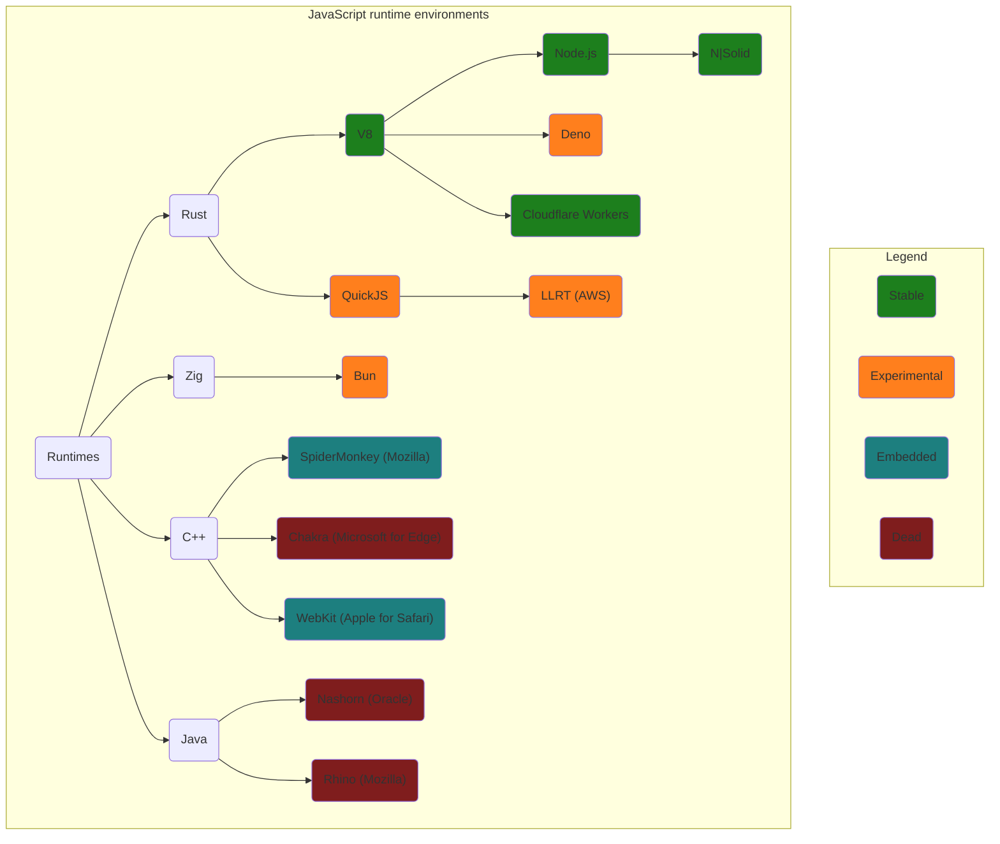

# JavaScript

:::info Ecosystem

By JavaScript, I mean the entire ecosystem including different runtimes, package managers and
TypeScript.

:::

## Resources

- [Web Spec](https://developer.mozilla.org/en-US/docs/Web/JavaScript)
- [Just JavaScript](https://justjavascript.com/learn) by Dan Abramov and Maggie Appleton (excellent
  quality)

## Runtime Manager

:::note

_More about [runtimes](#runtimes)._

:::

My current favourite is **Volta**.

- Installing **global versions** of Node and add global dependencies.
- Pinning **project versions** of Node and Yarn to a project
  - The pinned version is stored package.json
  - Switching project directories automatically switches to the pinned runtime and package manager
    versions, which makes for a great experience 🚀

Most used commands

```powershell
# Global
volta install node@lts
volta install <package>
volta list

# In projects
volta pin node@lts
volta pin yarn@latest
cat package.json
```

## Package management

Tips and tricks for how to manage packages in practice.

I've been using Yarn. `yarn` is quick to type, plays well with other tools like Volta, and it has
been progressively maintained over the years.

| Description                | Yarn                                                                                                                                                                                                          |
| -------------------------- | ------------------------------------------------------------------------------------------------------------------------------------------------------------------------------------------------------------- |
| Update packages            | `yarn upgrade-interactive`                                                                                                                                                                                    |
| Install a package globally | `volta install <package>`<br />_<sup><sub>**Note:** (`yarn global add` never worked well across platforms)</sub></sup>_<br />_<sup><sub>**Note:** (outside of a project folder when using volta)</sub></sup>_ |
| Linking a dependency       | `volta install yalc`<br />`yalc publish` _<sup><sub>(in dependency root)</sub></sup>_<br />`yalc link` _<sup><sub>(in project root)</sub></sup>_                                                              |

## Runtimes

Overview of JavaScript runtime landscape.


